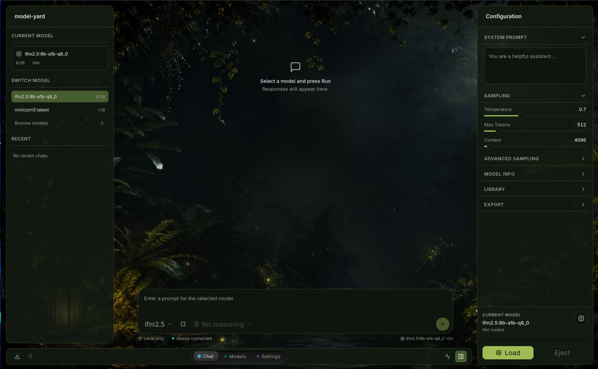

<div align="center">

# Model Yard

**A local-first desktop workbench for Ollama models.**

Test, run, and manage local Ollama models from one focused native interface —
streaming chat, generation controls, model pull/delete, and run history, all
talking directly to your local Ollama daemon.

[](https://v2.tauri.app/)
[](https://react.dev/)
[](https://www.typescriptlang.org/)
[](https://vitejs.dev/)
[](https://vitest.dev/)
[](https://www.rust-lang.org/)
[](https://tailwindcss.com/)
[](https://pnpm.io/)
[](https://ollama.com/)
[](#)
[](#)

<p align="center">
  
</p>

</div>

---

## Features

- **Ollama status panel** — daemon health, version, and systemd state at a glance.
- **Installed models** — list from `/api/tags`, loaded model / VRAM view from `/api/ps`.
- **Model browser** — search the Ollama library, filter by capability, pull and delete per tag.
- **Streaming chat** — multi-turn conversations with per-turn rerun and delete, live token + thinking streaming.
- **Generation controls** — temperature, top-p, top-k, repeat penalty, seed, context length, and predict count.
- **Prompt presets & favorites** — save prompts, pin models, and recall recent runs.
- **Run history** — persisted to local storage, with Markdown and JSON export of results.
- **Theming** — picture-based backgrounds (Midnight Garden preset) with AVIF/WebP/JPEG generation.

## Built with

| Layer | Tech |
| --- | --- |
| Desktop shell | Tauri 2 + Rust |
| Frontend | Vite, React 19, TypeScript (strict) |
| Styling | Tailwind CSS v4 + shadcn-style Radix UI |
| State | Local component state + `localStorage` persistence |
| Tests | Vitest + Testing Library (frontend), `cargo test` (Rust) |

## Requirements

- Node.js + [pnpm](https://pnpm.io/) 10
- Rust + Cargo
- [Ollama](https://ollama.com/) running locally at `http://localhost:11434`
- Tauri Linux WebKit dependencies

On CachyOS / Arch, install the Tauri system packages if `cargo check` reports `webkit2gtk-4.1` or `javascriptcoregtk-4.1`:

```bash
sudo pacman -S webkit2gtk-4.1
```

Depending on the local install, Tauri may also need common GTK build dependencies:

```bash
sudo pacman -S base-devel curl wget file openssl appmenu-gtk-module gtk3 librsvg
```

## Run

```bash
pnpm install
pnpm tauri:dev
```

The dev script sets `WEBKIT_DISABLE_DMABUF_RENDERER=1` so WebKitGTK stays stable on NVIDIA Wayland.

For the exported frontend only (layout preview — full Ollama behavior requires the Tauri shell):

```bash
pnpm build
```

## Architecture

The Rust backend owns **all** HTTP communication with Ollama — the frontend never calls `localhost:11434` directly. Commands are exposed via Tauri `invoke` and three streaming events (`chat-token`, `chat-thinking`, `pull-progress`).

```
React UI ──invoke──▶ Rust commands ──HTTP/NDJSON──▶ Ollama (/api/*)
   ▲                       │
   └─── Tauri events ──────┘  (streaming tokens, thinking, pull progress)
```

Notable backend responsibilities: concurrent model metadata inference (`supports_thinking`, `reasoning_modes`), cancellable streaming chat via `tokio::select` + a shared `Notify`, ollama.com library scraping for the model browser, and GPU detection through `nvidia-smi`.

## Project structure

```
src/                 React entry + feature components
  model-yard/        Chat thread, model browser, settings, navigation, controls
components/          Shared components + shadcn-style UI primitives (components/ui)
lib/                 TS utilities: chat, tauri bridge, storage, types, formatting
src-tauri/src/       Rust backend (lib.rs — commands, streaming, scraping)
public/backgrounds/  Theme background assets
documentation/       Ollama API notes + screenshots
```

## Development & testing

```bash
pnpm typecheck      # tsc --noEmit
pnpm test:unit      # vitest run
pnpm test:rust      # cargo test
pnpm test           # all of the above
```

## Documentation

Developer notes on the Ollama HTTP API, streaming/thinking behavior, model metadata, and storage live in [`documentation/ollama/`](documentation/ollama/). The guiding rule: use Ollama's HTTP API as the source of truth — do not depend on model names, filesystem paths, or inferred conventions when an endpoint exposes the information.

## License

Not yet licensed. Add a `LICENSE` file and update this section before distribution.
